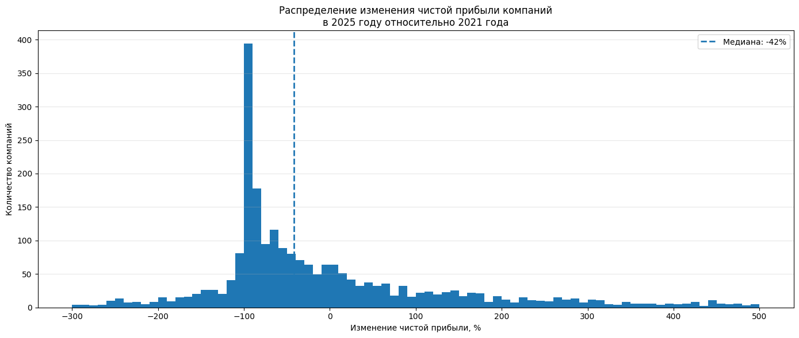
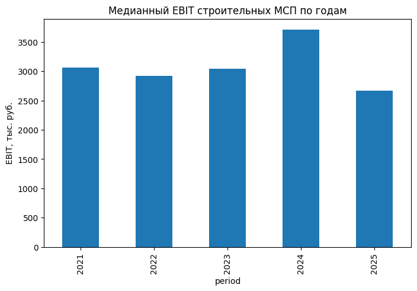
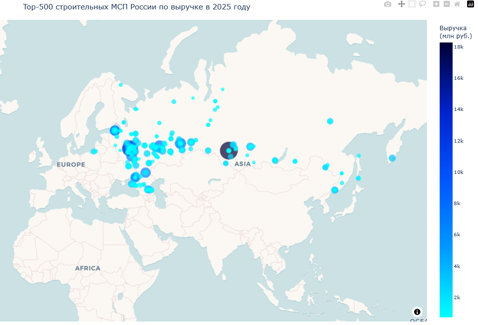

# 🏗️ Анализ рынка строительных МСП России

> Исследовательский проект по анализу отрасли строительства жилых и нежилых зданий (ОКВЭД **41.20**) на основе данных ФНС.

<p align="center">
  <b>Сбор данных → Очистка → Парсинг → Финансовый анализ → Визуализация → Геоанализ</b>
</p>

---

## 📌 О проекте

Цель проекта — оценить состояние и перспективность рынка российских малых и средних предприятий строительной отрасли.

В качестве объекта исследования рассматриваются **юридические лица**, относящиеся к малым и средним предприятиям, с основным видом деятельности **41.20 — «Строительство жилых и нежилых зданий»**.

Поскольку готового датасета для работы не предоставлялось, данные были собраны и подготовлены самостоятельно:

- сформирована выборка строительных МСП;
- выполнен парсинг финансовой информации;
- собраны показатели за несколько лет;
- рассчитана динамика чистой прибыли;
- проанализирован EBIT по годам;
- сформирован **Top-500 компаний по выручке**;
- выполнена географическая визуализация компаний на карте.

---
## 📂 Структура проекта

```text
.
├── 01_filter_reestr.ipynb   # Фильтрация реестра ФНС
├── 02_eda.ipynb             # Первичный анализ данных
├── 03_parsing.ipynb         # Парсинг финансовой информации
├── 04_metrics.ipynb         # Расчёт метрик и визуализация
│
├── data/                    # Рабочие данные
├── images/                  # Графики и визуализации
│
└── README.md
```

---

## 🛠️ Используемые технологии

| Инструмент | Назначение |
|---|---|
| 🐍 Python | основной язык проекта |
| 📓 Jupyter Notebook | проведение исследования |
| 🐼 Pandas | обработка и анализ данных |
| 🔢 NumPy | численные операции |
| 📊 Matplotlib | построение графиков |
| 🗺️ GeoPandas | географический анализ |
| 📈 Plotly | интерактивная визуализация |
| 🌐 Requests | получение данных с веб-ресурсов |
| 📍 Nominatim / OpenStreetMap | геокодирование городов |

---

## 🔎 Сбор и подготовка данных

Исходный реестр ФНС был предварительно отфильтрован по следующим условиям:

- форма организации — **юридическое лицо**;
- размер предприятия — **малое или среднее предприятие**;
- вид деятельности — **ОКВЭД 41.20**;
- в дальнейшем для анализа использовались идентификаторы организаций и ИНН.

После формирования выборки финансовые показатели компаний были получены с информационного ресурса ФНС.

Для каждой компании извлекались доступные значения по годам, в том числе:

- выручка;
- чистая прибыль;
- прибыль до налогообложения;
- проценты к уплате;
- EBIT.

---
## 📈 Динамика чистой прибыли

Для анализа изменения финансового результата была рассчитана динамика чистой прибыли за период **2021 → 2025**.
Процентное изменение рассчитывалось только для компаний, у которых базовая прибыль в 2021 году была положительной. Дополнительно применено отсечение компаний с очень маленькой базой прибыли, чтобы уменьшить влияние экстремальных процентных значений.

### Распределение изменения чистой прибыли



График показывает, насколько сильно различается изменение чистой прибыли между компаниями.

Основной результат анализа:

- около **58,7%** компаний продемонстрировали снижение прибыли;
- около **41,1%** компаний показали рост;
- медианное изменение чистой прибыли оказалось отрицательным;
- среднее значение существенно искажено экстремальными наблюдениями.

Поэтому для характеристики типичной компании предпочтительнее использовать **медиану**, а не среднее арифметическое.

---

## 📊 EBIT по годам

Дополнительная метрика — медианный EBIT строительных МСП по годам.



Данный показатель позволяет посмотреть на изменение типичного финансового результата компаний во времени и дополнить анализ динамики чистой прибыли.

---

## 🗺️ География крупнейших компаний

Отдельная часть исследования посвящена географии бизнеса.

Из выборки сформирован **Top-500 компаний по выручке**, после чего для городов регистрации были получены географические координаты.

## 🗺️ Интерактивная карта
Из выборки сформирован **Top-500 компаний по выручке**, после чего для городов регистрации были получены географические координаты.В рамках проекта была построена интерактивная карта, на которой отображаются компании по месту их регистрации. Размер маркера и его цвет отражают величину выручки, что позволяет наглядно оценить географическое распределение крупнейших компаний строительной отрасли.



### Что показывает геоанализ

Крупнейшие строительные компании концентрируются преимущественно в крупнейших экономических центрах России.
Такое распределение может быть связано с концентрацией строительного спроса, капитала и крупных инвестиционных проектов.

---

## 📌 Основные результаты

### Финансовая динамика
По исследуемой выборке не наблюдается устойчивого роста чистой прибыли большинства компаний.
Медианное изменение прибыли за 2021–2025 годы отрицательное, при этом разброс результатов очень велик.

### Итоговая оценка
На основании выбранных финансовых метрик **строительный рынок МСП нельзя однозначно назвать устойчиво растущим**.
При этом наличие компаний с очень высокой положительной динамикой показывает, что внутри отрасли существуют отдельные быстрорастущие сегменты и предприятия.

Следовательно:

> **Строительная отрасль неоднородна: средняя компания демонстрирует ухудшение финансового результата, однако отдельные компании показывают значительный рост. Поэтому перспективность отрасли целесообразно оценивать не только в целом, но и с учётом региона, размера и конкретной бизнес-модели компании.**

---

<p align="center">
  <i>Data → Analysis → Visualization → Insights</i>
</p>
